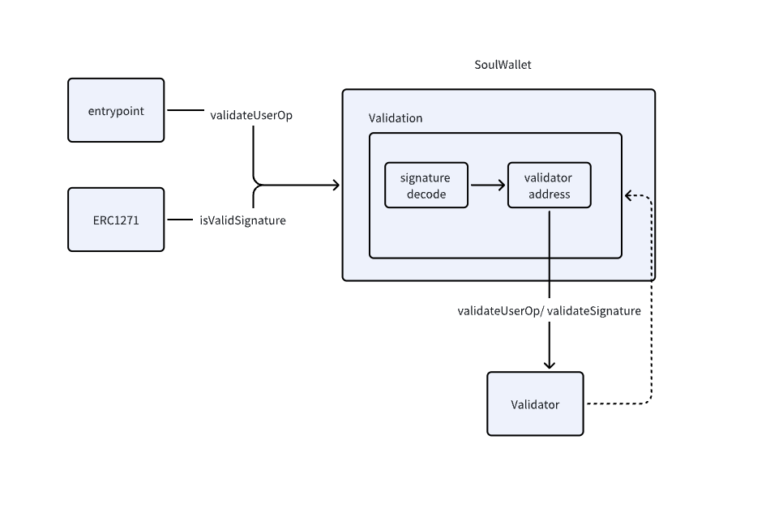

# Validator Introduction

The `Validator` contract is responsible for validating signatures. It implements the `IValidator` interface, which defines the necessary methods for signature validation.

By default, SoulWallet implements the `Validator` contract with two signature verification schemas: ECDSA and passkey.

Users can generate their passkeys, which can then be used for signature verification. This feature provides an additional layer of security and flexibility, allowing users to authenticate their operations in a way that best suits their needs.

## Signature Validation Methods

The `Validator` contract supports two main validation flows: user operation validation and ERC1271 standard signature validation for contracts.

### User operation validation flow

In the standard ERC4337 user operation, the entry point calls `account.validateUserOp` in the `handleOps` operation. First, the user operation signature is decoded in the `validateUserOp` function. The first 32 bytes define the validator address. If the validator address is installed in the SoulWallet contract, it will trigger a view call to the validation contract. The `validator` will then validate the correctness of the signature.

### ERC1271 Standard Signature Validation

The `Validator` contract also supports the ERC1271 standard for signature validation. This standard defines a `isValidSignature` function that contracts can implement to validate signatures. Similar to the user operation signature decoding, when `isValidSignature` is invoked, the initial 32 bytes define the validator address.

The SoulWallet user operation signature format is as follows:

- `[0:20]`: `validator address` - This is the address of the validator contract that will verify the signature.
- `[20:24]`: `validator signature length` - This is the length of the validator signature. It is a 4-byte value, allowing for a maximum signature length of 2^32.
- `[24:24+n]`: `validator signature` - This is the actual signature produced by the validator. Its length is determined by the `validator signature length` field.
- `[24+n:]`: `hook signature` - This is an optional signature for a hook function that can be executed after the main operation.

